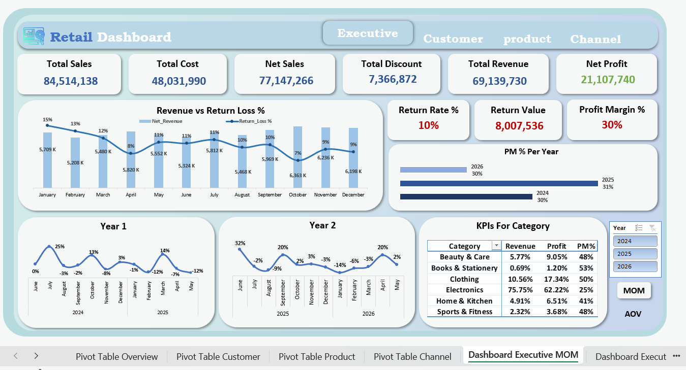
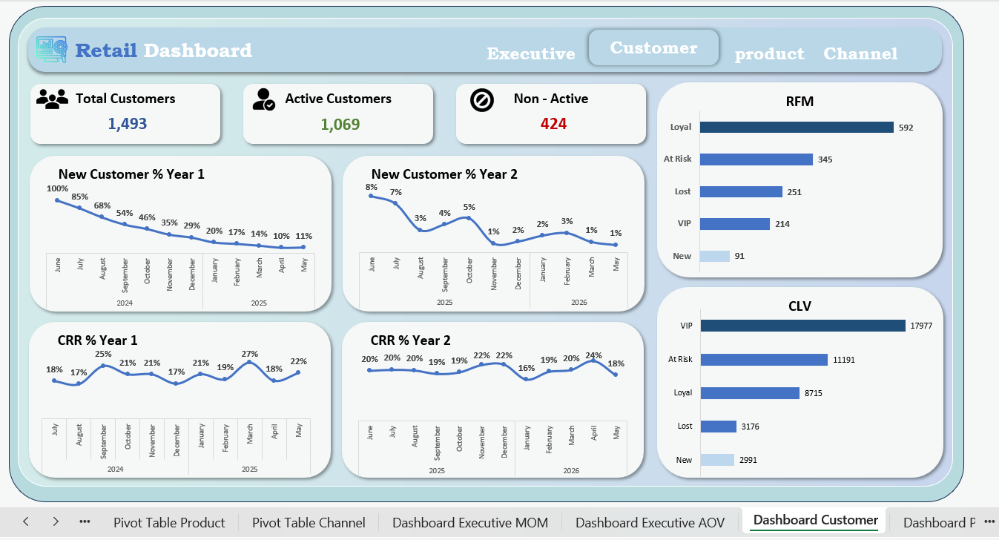
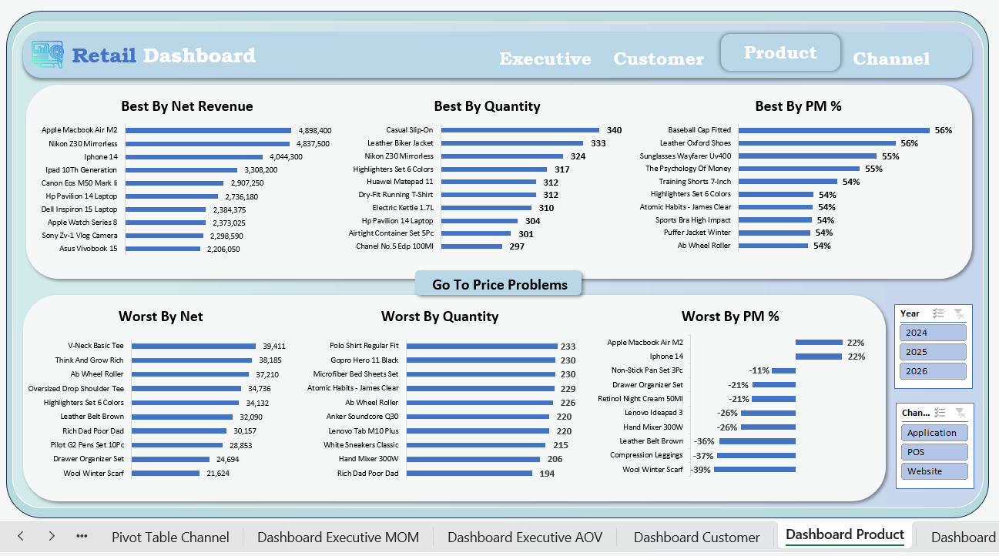
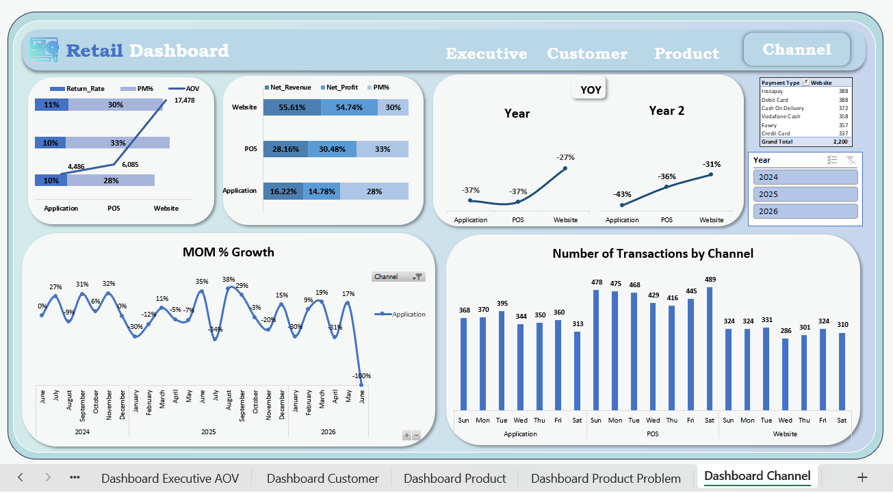

# 📊 Retail Sales Analytics | Microsoft Excel

An end-to-end retail sales analytics project built with Microsoft Excel.

This project covers the complete analytics workflow, from data cleaning and modeling to building interactive dashboards that provide business insights.

## 🛠 Tools

- Microsoft Excel
- Power Query
- Power Pivot
- DAX

## 📌 What I Worked On

- Data Cleaning
- Data Modeling
- Calendar Table
- DAX Measures
- Time Intelligence (MoM & YoY)
- RFM Analysis
- Customer Segmentation
- Customer Lifetime Value (CLV)
- Customer Retention Analysis
- Interactive Dashboards

---

# 📊 Dashboard Pages

## Executive Overview (MoM)

- Revenue, Profit & Return KPIs
- Month-over-Month Growth
- Profit Margin Analysis

---

## Executive Overview (AOV)

- Average Order Value
- Revenue vs Return Analysis
- Category Performance

---

## Customer Dashboard

- Customer Segmentation
- RFM Analysis
- Customer Lifetime Value
- Customer Retention
- New vs Returning Customers

---

## Product Dashboard

- Best & Worst Performing Products
- Revenue Analysis
- Quantity Analysis
- Profit Margin Analysis

---

## Product Price Problems

- Products with Negative Profit
- Discount & Return Impact
- Price Problem Detection

---

## Channel Dashboard

- Channel Performance
- Revenue Contribution
- Number of Transactions
- MoM Growth

---

# 🎥 Demo

Watch the complete dashboard walkthrough on LinkedIn:

**🔗 Demo Video:** https://www.linkedin.com/posts/ahmeddelemam_dataanalytics-dataanalysis-microsoftexcel-ugcPost-7485463569900240896-etqw/?utm_source=share&utm_medium=member_desktop&rcm=ACoAAErS4uwBUJFyHdTqx2NJLdyhyNWz6AnwWuE

---

# 👤 Author

**Ahmed Elemam**

- LinkedIn: www.linkedin.com/in/ahmeddelemam
