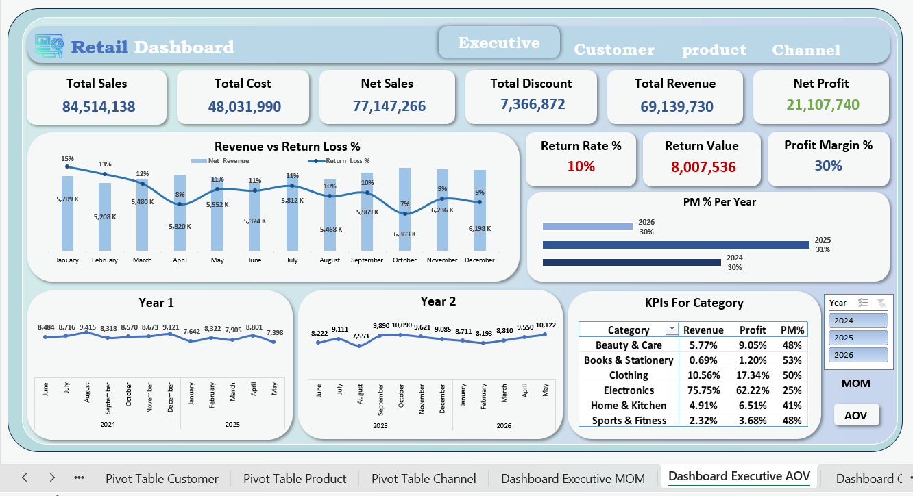
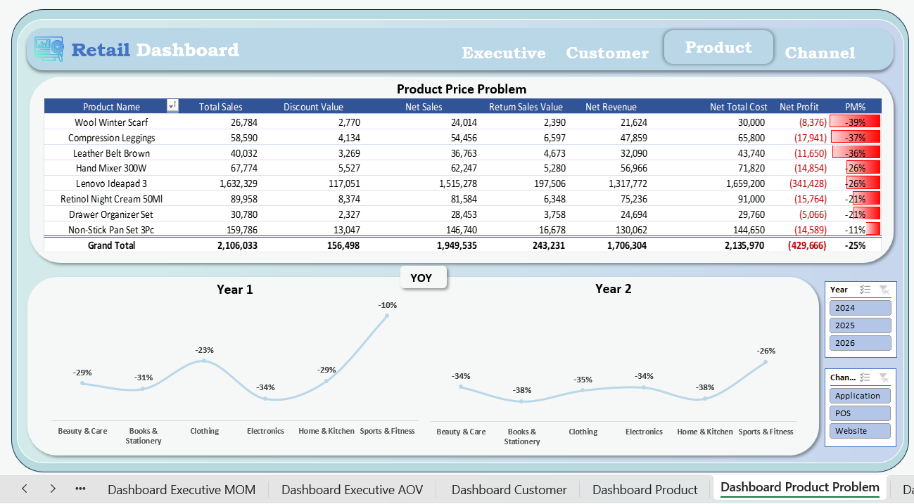

# 📊 Retail Sales Dashboard | Microsoft Excel

This project is an end-to-end Retail Sales Analysis built using Microsoft Excel.

The goal was to turn raw sales data into an interactive dashboard that helps understand business performance and supports better decision-making.

## Tools Used

- Microsoft Excel
- Power Query
- Power Pivot
- DAX

## What I worked on

- Data Cleaning with Power Query
- Data Modeling
- Calendar Table
- DAX Measures
- Time Intelligence (MoM & YoY)
- RFM Analysis
- Customer Segmentation
- Customer Lifetime Value (CLV)
- Customer Retention Analysis
- Interactive Dashboards

---

## Dashboard Pages

### Executive Overview
- Revenue, Profit & Return KPIs
- MoM & YoY Analysis
- Average Order Value (AOV)

---

### Customer Dashboard

- Customer Segmentation
- RFM Analysis
- Customer Retention
- Customer Lifetime Value
- New vs Returning Customers

---

### Product Dashboard

- Best & Worst Performing Products
- Revenue & Profit Analysis
- Quantity Analysis

---

### Product Price Problems

- Products with negative margins
- Discount & Return impact
- Price issue detection

---

### Channel Dashboard

- Performance by Channel
- Revenue Contribution
- Number of Transactions
- MoM Growth

---

## Project Demo

The full project walkthrough is available on LinkedIn:

🔗 **Watch the Demo Video**
(Paste your LinkedIn post link here)

---

## Author

Ahmed Elemam
- LinkedIn: www.linkedin.com/in/ahmeddelemam
